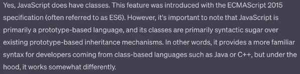

# Does javascript contains classes ?

## OOP

## Object   
- Collection of properties and methods.
- toLowerCase, toUpperCase, etc.

## Why to use OOP?

## Parts of OOP
Object Literal

- Constructor function
- Prototypes
- Classes
- Instances (new,this)

## 4 Pillars
Abstraction
Encapsulatino
Inheritance
Polymorphism
